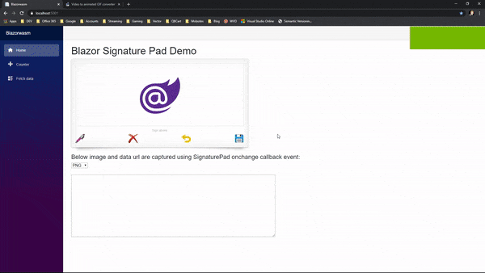

# Blazor Signature Pad
by <a href="https://www.mobsites.com">obsites</a>

A Blazor UI component that utilizes [Szymon Nowak](https://github.com/szimek)'s Signature Pad javascript library to implement smooth signature drawing on a HTML5 canvas.

***Don't worry! You don't have to touch any javascript to make use of this library. Blazor Signature Pad abstracts all of that away for you. Just plug and play, baby.***

## [Demo](https://www.mobsites.com/Blazor.SignaturePad/)
Tap the link above to go to a live demo. Try some of the options to get an idea of what's possible. Then reload the app in the browser and watch how the state was kept! 

Check out its source code [here](./demo).

## For
* Blazor WebAssembly
* Blazor Server

## Dependencies

###### .NETStandard 2.0
* Microsoft.AspNetCore.Components (>= 3.1.3)
* Microsoft.AspNetCore.Components.Web (>= 3.1.3)
* Mobsites.Blazor.BaseComponents (>= 1.0.1)

## Design and Development
The design and development of this Blazor component was heavily guided by Microsoft's [Steve Sanderson](https://blog.stevensanderson.com/). He outlines a superb approach to building and deploying a reusable component library in this [presentation](https://youtu.be/QnBYmTpugz0) and [example](https://github.com/SteveSandersonMS/presentation-2020-01-NdcBlazorComponentLibraries).

As for the non-C# implementation of this component library, obviously the Signature Pad [docs](https://github.com/szimek/signature_pad) were consulted carefully. And it goes without saying (but I'm going to say it anyway), that Blazor Signature Pad would not be what it is...were it not for [Szymon Nowak](https://github.com/szimek)'s hard work beforehand.

Now, not every aspect of his awesome javascript library has been ported over, and I can't say that it ever will. I am still considering a few aspects as well as possible extensions to it (in C#, mind you). If you are familiar with said javascript library and have any suggestions, feel free to chime in and contribute.

## Getting Started
Check out our new [docs](https://www.mobsites.com/blazor/signature-pad) to help you get started.

## Shout Out
I want to thank [Mike](https://github.com/michaelfw2020) for raising this [issue](https://github.com/Mobsites/Blazor.SignaturePad/issues/2) concerning complex signature failures on Blazor Server when calling `toDataUrl()` method as well as his contribution to address this, which was happily merged into the source.
